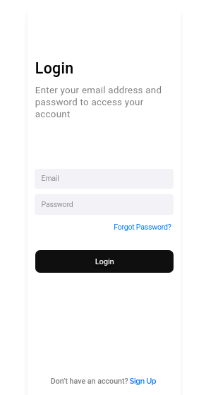

#  Sign In
  
  

  
> Resultado do projeto Sign In, primeira tela desenvolvida \o/.
  
###  Ajustes e melhorias
  
  
O projeto ainda está em desenvolvimento e as próximas atualizações serão voltadas nas seguintes tarefas:
  
- [x] Criação do HMTL
- [x] Criação do CSS
- [ ] Criação do JavaScript
- [ ] Melhorias no Layout
- [ ] Funcionalidade
  
##  🤝 Colaboradores
  
  
Agradecemos às seguintes pessoas que contribuíram para este projeto:
  
<table>
  <tr>
    <td align="center">
      <a href="linkedin.com/in/tracy-minervini-25a8111a3">
         
        
          <b>Tracy Minervini</b>
        
      </a>
    </td>
    </tr>        
</table>
  
##  😄 Seja um dos contribuidores 
  
  
Quer fazer parte desse projeto? Clique [AQUI](CONTRIBUTING.md ) e leia como contribuir.
  
##  📝 Licença
  
  
Esse projeto está sob licença. Veja o arquivo [LICENÇA](LICENSE.md ) para mais detalhes.
  
[⬆ Voltar ao topo](#nome-do-projeto ) 
  